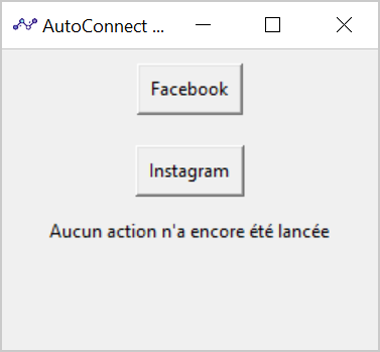

 

#

<strong>AutoConnect is a simple Python application created to make my life easier. It allows quick connection to Facebook or Instagram from a single button</strong>

 
 

## Table of Contents

1. [Getting Started](#getting-started)
2. [Technologies](#technologies)
3. [Guides and resources](#guides-and-resources)
4. [Authors](#authors)
5. [License](#license)

## Getting Started

### Running the application

You will need to follow the steps below in order to run the application :

1. Python *(3.7 or higher)* must be installed on your machine.
2. Selenium must be downloaded *(when you have Python installed, run `pip install selenium` in your terminal to download it)*.
3. The webdrivers of the browser you want to use (Chrome / Firefox) must be added to the PATH. To add the webdriver to the PATH, consult the following page: [Driver requirements](https://www.selenium.dev/documentation/en/webdriver/driver_requirements/)
4. Your own credentials must be put in the `credentials.py` file if you want to be able to connect to Facebook or Instagram automatically via the application.

🎉 You're good to go ! You can now launch the application via your terminal or Python's IDLE.

## Technologies

The **AutoConnect** application relies on 2 dependencies :
1. the InternetBot class : A class I created to ease the use of Selenium
2. tkinter : Python's standard GUI package

The **InternetBot** class relies on 2 dependencies as well :
1. Selenium : An automated testing framework for web applications
2. Python's os module : Module that provides a portable way of using operating system dependent functionality

## Guides and resources

* [Tkinter](https://wiki.python.org/moin/TkInter) - Python's standard GUI package
* [Selenium](https://selenium-python.readthedocs.io/) - An automated testing framework for web applications
* [Python's os module](https://docs.python.org/3/library/os.html) - Module that provides a portable way of using operating system dependent functionality

## Authors

<table>
   <tbody>
      <tr>
         <td align="center" valign="top" width="100%">
            <a href="https://github.com/d-roduit">
             
            Daniel Roduit
            </a>
         </td>
      </tr>
   </tbody>
</table>

## License

This project is licensed under the MIT License
